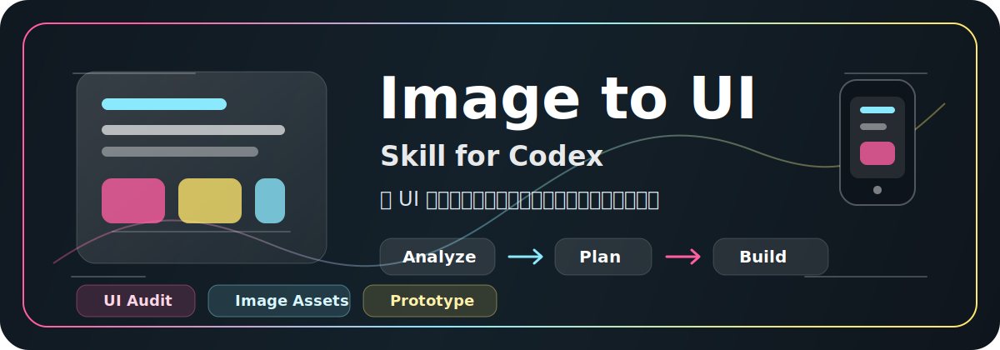

# 🎨 Image to UI Skill

<div align="center">



**✨ 把设计图变成代码，只需 3 步 ✨**

*AI 驱动的 UI 转代码工具 - 智能分析 · 自动生成 · 无缝集成*

[](https://opensource.org/licenses/MIT)
[](https://cursor.sh)


</div>

---

## 🎯 功能对比

| 场景 | 以前 | 现在 |
|:-----|:-----|:-----|
| 🌧️ 看到好看的设计图 | 😩 不知道从何下手 | 🚀 一键分析出实现方案 |
| 🌧️ 需要提取图片资产 | ⏰ 手动一个个导出 | ⚡ AI 自动识别生成 |
| 🌧️ 想做抠图透明背景 | 💰 用 Photoshop | ✂️ AI 智能抠图 |
| 🌧️ 验证还原度 | 👀 肉眼对比 | 🔍 自动标注差异 |

---

## 🔥 核心功能

### 💖 智能分析
```
输入: 设计截图 / Figma 导出图 / App UI 截图
      ↓
AI 分析:
  ├─ 🔧 可代码实现  →  按钮、卡片、导航、表单、布局
  ├─ 🎨 需要生成    →  插画、照片、背景、纹理
  └─ ✂️ 需要抠图    →  产品图、人物、物体透明背景
      ↓
输出: 详细的前期审查报告
```

### 💗 资产规划
自动生成包含以下信息的资产清单：
- 📐 **尺寸** - 目标槽位 & 导出尺寸
- 📝 **提示词** - 适合 AI 生图的描述
- 🎯 **用途** - UI 位置和集成方式
- 🔧 **后处理** - 裁剪、压缩、去背景需求

### 💓 代码生成
```
┌──────────────┐     ┌──────────────┐     ┌──────────────┐
│   HTML/CSS   │  +  │  React/Vue  │  +  │  组件化代码  │
│   基础结构    │     │  现代框架    │     │  可复用     │
└──────────────┘     └──────────────┘     └──────────────┘
```

### 💕 质量审查
```
原图对比 ──→ 差异分析 ──→ 差异标注 ──→ 调整优化 ──→ 最终验收
  🔍           📊          🏷️          ✏️           ✅
```

---

## 👥 适用人群

<div align="center">

| 🌸 设计师 | 💻 开发者 | 📱 产品经理 | 🚀 创业者 |
|:---------:|:---------:|:-----------:|:---------:|
| 验证设计能否实现 | 快速拿到可运行代码 | 快速搭建原型 | 把灵感变成产品 |
| 获取开发建议 | 专注业务逻辑 | 可交互原型演示 | 0→1 快速验证 |

</div>

---

## 🚀 快速开始

```markdown
1️⃣  安装 Skill 到 Codex skills 目录或 Cursor 项目
2️⃣  上传 UI 参考图
3️⃣  直接点名 skill，并把目标说清楚
```

推荐最短通用说法：

```text
使用 image-to-ui-skill，参考我上传的图，完成[任务类型]。
还原目标是[高保真复刻 / 风格参考]。
必须真实调用 image2 生图的区域是：[区域A]、[区域B]、[区域C]。
保留[文字 / 按钮 / 导航 / 表单 / 列表]为代码实现。
输出[HTML/CSS/JS / React / Vue / 其他技术栈]。
直接开始，不用先问我。
```

如果你担心模型又退回成“只做代码近似”，可以再补一句：

```text
如果没有真实生成位图并接入页面，不要告诉我已经用了 image2。
```

---

## 🧭 Codex 使用流程

### Step 1: 安装到 Codex

将本仓库放到 Codex 的 skills 目录，并保持文件夹名和 `SKILL.md` 里的 `name` 一致：

```powershell
git clone https://github.com/zhu-guli326/image2_UI_skill.git "$env:USERPROFILE\.codex\skills\image-to-ui-skill"
```

macOS / Linux 可使用：

```bash
git clone https://github.com/zhu-guli326/image2_UI_skill.git "${CODEX_HOME:-$HOME/.codex}/skills/image-to-ui-skill"
```

安装后重新打开 Codex 会话，或在新会话中使用这个 skill。

### Step 2: 触发 Skill

在 Codex 对话里上传 UI 截图、设计稿或 App 页面参考图，然后明确点名 skill：

```text
Use $image-to-ui-skill 分析这张 UI 参考图，先给前期审查，不要立刻生成图片。
```

也可以直接要求进入实现：

```text
Use $image-to-ui-skill 把这组 App 截图做成可点击 React 原型。先列出图片资产清单，需要生成的资产确认后再继续。
```

如果 skill 已安装且请求语义足够明确，Codex 也会根据 `SKILL.md` 的 description 自动触发。

### Step 3: Codex 执行节奏

```text
上传参考图
  ↓
Codex 读取 image-to-ui-skill
  ↓
前期审查：布局、字体、图片资产、版权/品牌风险
  ↓
输出资产清单：槽位尺寸、导出尺寸、提示词、后处理、目标路径
  ↓
确认关键问题，或按用户要求直接继续
  ↓
生成/处理图片资产，并把文字、按钮、表单、导航继续用代码实现
  ↓
集成到前端项目，补齐主要点击路径
  ↓
桌面端/移动端截图验证，并与原图对比修正
```

### Step 4: 推荐 Prompt 模板

先补这 6 个信息，skill 的稳定性会更高：

- **做什么**：`可点击 demo` / `静态页面` / `只分析` / `只出图` / `改现有项目`
- **还原程度**：`高保真复刻` / `风格参考`
- **哪些必须生图**：例如 `主视觉`、`卡片图`、`插画`、`背景纹理`、`地图`、`产品图`
- **设备或画布**：例如 `iPhone 15 Pro`、`桌面端 1440px`、`3:4`、`H5 长屏`
- **页面数量**：例如 `1 页`、`首页 + 详情页`、`3 个状态页`
- **技术要求**：例如 `HTML/CSS/JS`、`React`、`Vue`、`Tailwind`

#### 1. 通用开工模板

```text
使用 image-to-ui-skill，参考我上传的图，完成[任务类型]。
目标是[高保真复刻 / 风格参考]。
必须真实调用 image2 生图的区域：[区域A]、[区域B]、[区域C]。
保留[文字 / 按钮 / 导航 / 表单]为代码实现。
目标设备或画布：[设备或比例]。
页面范围：[页面数量或页面列表]。
输出：[技术栈]。
直接开始，不用先问我。
```

#### 2. 只分析，不立刻写代码

```text
使用 image-to-ui-skill，先不要写代码。
先分析我上传的这张 UI 图，并输出：
1. 哪些部分适合代码实现
2. 哪些部分必须真实调用 image2 生图
3. 资产清单、尺寸建议和提示词
4. 主要风险和需要我确认的点
```

#### 3. 新项目直接生成可点击原型

```text
使用 image-to-ui-skill，参考我上传的图，高保真复刻成[桌面端 / 手机端 / 响应式]可点击 demo。
必须真实调用 image2 生图。
需要生图的区域：[主视觉]、[卡片缩略图]、[插画或背景]。
其余结构保持代码实现。
输出[HTML/CSS/JS / React / Vue]，直接开始。
```

#### 4. 改现有项目，但模板保持通用

```text
基于当前项目，使用 image-to-ui-skill 继续修改。
不要重做整体结构，只替换这些区域为真实 image2 生图并接回页面：[区域A]、[区域B]、[区域C]。
完成后自动测试主要点击路径，并截图给我。
```

#### 5. 只做图片资产，不生成页面

```text
使用 image-to-ui-skill，参考我上传的图，只生成图片资产，不要输出页面代码。
请列出资产清单，并生成这些内容：[主视觉 / 缩略图 / 插画 / 透明抠图 / 背景纹理]。
保持统一风格，输出文件命名建议和使用说明。
```

#### 6. 防止“只做代码近似”的补充句

```text
如果没有真实生成位图并接入页面，不要告诉我已经用了 image2。
```

### Step 5: 交付物

Codex 最终应交付：

- 前期审查文档
- 图片资产清单和 Image2 提示词
- 生成或后处理后的图片资产路径
- 前端代码改动和可运行页面
- 桌面端/移动端渲染检查结果
- 与原始参考图的主要差异、已修正项和剩余取舍

---

## 📖 完整工作流

### Step 1: 上传参考图
```
支持格式: PNG / JPG / WebP / Figma 截图 / App 截图
```

### Step 2: 获取分析报告
```
🌸 前期审查文档

整体判断:
├── 🌺 页面类型: 电商 App 首页
├── 🌺 视觉风格: 简约现代 + 渐变卡片
└── 🌺 实现风险: 中等

元素分类:
├── ✅ 容易实现 (75%)
│   └── 导航栏、搜索框、商品卡片、按钮
├── 🎨 需要生成 (20%)
│   └── 首屏 Banner、分类图标、空状态插画
└── ✂️ 需要抠图 (5%)
    └── 商品白底图、模特图

需要确认:
├── ❓ Logo 是否使用原图？
├── ❓ 字体是否接受近似替代？
└── ❓ 移动端是否需要单独适配？
```

### Step 3: 确认后生成
```
⏳ 正在生成...
├── 🎨 生成首屏背景图... ✅
├── 🎨 生成空状态插画... ✅
├── ✂️ 抠取商品透明图... ✅
├── 💻 生成 React 代码... ✅
└── 🔍 验证还原度... ✅

💖 完成！生成 5 个资产 + 1 套可运行代码
```

### Step 4: 审查验收
```
🌸 还原度检查报告:
├── 布局比例        ✅ 95% 匹配
├── 字体还原        ✅ 90% 相似
├── 图片融合        ✅ 视觉一致
├── 响应式适配      ✅ 桌面/移动端正常
└── 交互跳转        ✅ 可点击元素完整

🎉 可以发布到生产环境了！
```

---

## ⚡ 效果对比

<div align="center">

| 指标 | 传统方式 | 使用本 Skill |
|:-----|:---------|:-------------|
| 分析时间 | 30 分钟 | **3 分钟** |
| 提取资产数量 | 手动提取 | **自动识别** |
| 代码可用性 | 需要调整 | **直接可用** |
| 还原度验证 | 肉眼对比 | **自动标注** |

</div>

---

## 🎨 支持的输出

| 代码框架 | 图片格式 | 智能识别 |
|:---------|:---------|:---------|
| ✅ HTML / CSS | ✅ PNG (透明背景) | ✅ 桌面端 UI |
| ✅ React | ✅ WebP (压缩优化) | ✅ 移动端 App |
| ✅ Vue | ✅ JPG (照片) | ✅ 响应式设计 |
| ✅ Tailwind CSS | ✅ 2x 视网膜屏 | ✅ 深色/浅色模式 |

---

## 🔒 注意事项

| ⚠️ 建议 | 💡 说明 |
|:--------|:--------|
| Logo 和商标 | 使用用户提供的原图，不要 AI 重画 |
| 特殊字体 | 需要确认授权，优先使用开源字体 |
| 版权素材 | 人物照片、真实产品建议用原图 |
| 生成风格 | AI 生成可能略有差异，可多次尝试 |

---

## 📚 相关资源

| 文件 | 说明 |
|:-----|:-----|
| 📄 [SKILL.md](./SKILL.md) | 完整 Skill 规范文档 |
| 🤖 [agents](./agents/) | Agent 配置文件 |
| 📖 [references](./references/) | 参考文档和模板 |

---

## 🤝 贡献

欢迎 Star ⭐ | Issues 🐛 | PRs 🔀

---

<div align="center">

**💖 让设计到代码的转化，像魔法一样简单 💖**

*Made with ❤️ for developers and designers*

</div>
