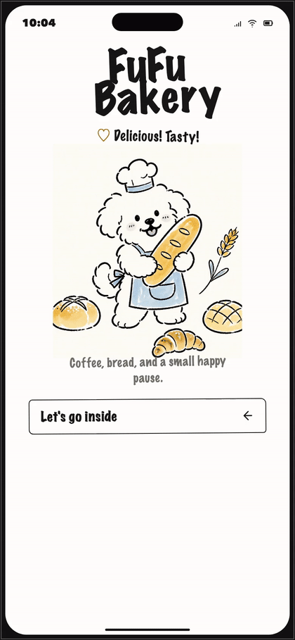
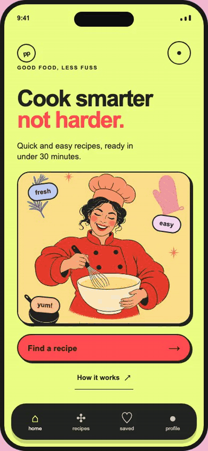
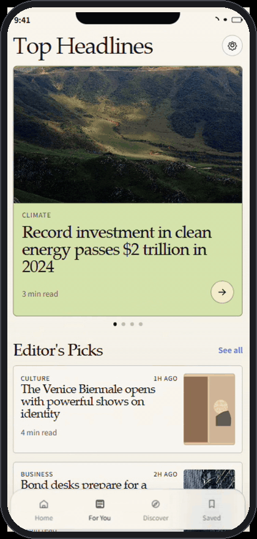
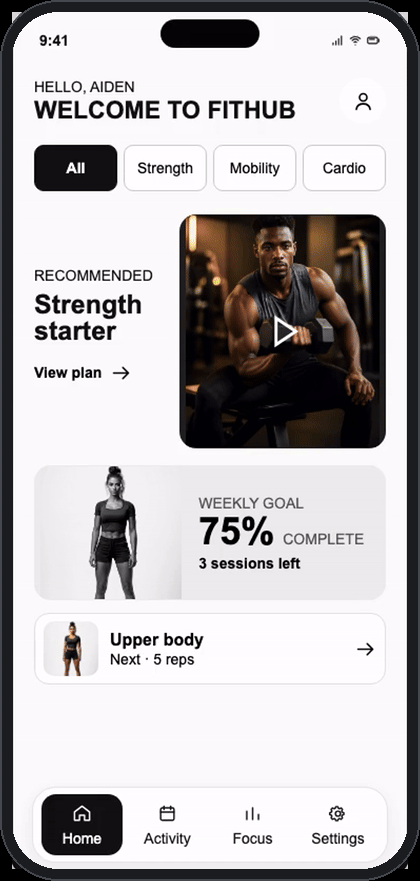

# Image2 UI

<p align="center">
  <strong>Screenshot to code &amp; AI UI generation for OpenAI Codex.</strong><br>
  Turn screenshots, design references, Figma exports, or a text prompt into editable, interactive frontend UI.<br>
  把截图、设计稿、参考图或一句产品描述，变成可运行、可点击、可继续修改的前端界面。
</p>

<p align="center">
  <a href="./LICENSE"></a>
  
  
  
</p>

<p align="center">
  
</p>

## Demos

Rendered, clickable UI demos—navigation, state changes, generated image assets, and code-rendered controls working together.

<div align="center">
  <table>
    <tr>
      <td align="center" width="25%">
        <strong>FuFu Bakery</strong><br>
        <sub>Hand-drawn character art, welcome flow, and bakery menu screens</sub><br>
        
      </td>
      <td align="center" width="25%">
        <strong>Plate Play</strong><br>
        <sub>High-color illustrated recipes, craving filters, and saved states</sub><br>
        
      </td>
      <td align="center" width="25%">
        <strong>Today</strong><br>
        <sub>Newspaper-inspired reading, headline carousel, and article feed</sub><br>
        
      </td>
      <td align="center" width="25%">
        <strong>FitHub</strong><br>
        <sub>Minimal fitness planning with workout photography and weekly goals</sub><br>
        
      </td>
    </tr>
  </table>
</div>

<p align="center">
  <strong><a href="https://www.ondesign.tech/library.html?lang=zh">Explore the complete UI Case Gallery →</a></strong>
</p>

## Why Image2 UI

- **Real code, not a flattened mockup** — text, buttons, forms, navigation, and interactions stay editable.
- **Separate visual assets** — photos, products, and illustrations are standalone generated images, never baked into the page.
- **Three workflows** — `recreate` a reference faithfully, `redesign` it for a new brand, or `create` from a description.
- **Fidelity loop** — browser render, reference comparison, visual audit, and a bounded fix queue.
- **Device-accurate details** — Safe Area, Dynamic Island, Status Bar, Home Indicator, and bottom navigation.

## Quick Start

Requires Node.js 20+, Python 3.10+, and Codex. Playwright/Chromium is optional for render checks.

macOS / Linux:

```bash
git clone https://github.com/zhu-guli326/image2_UI_skill.git "${CODEX_HOME:-$HOME/.codex}/skills/image2_UI_skill"
cd "${CODEX_HOME:-$HOME/.codex}/skills/image2_UI_skill" && npm link
image2-ui doctor
```

Windows (PowerShell):

```powershell
git clone https://github.com/zhu-guli326/image2_UI_skill.git "$env:USERPROFILE\.codex\skills\image2_UI_skill"
cd "$env:USERPROFILE\.codex\skills\image2_UI_skill"; npm link
image2-ui doctor
```

`npm link` exposes the global `image2-ui` command; use `node scripts/image2-ui` to run it from the checkout without installing.

## Usage

```bash
# Recreate a UI from a screenshot (default when --reference is set)
image2-ui run ./output --task "Recreate this mobile UI faithfully" --reference ./reference.png

# Keep the visual language, redesign for a new product
image2-ui run ./output --mode redesign --task "Redesign it as a travel app" --reference ./reference.png

# Generate a new UI from a description
image2-ui run ./output --mode create --task "Create a premium mobile finance dashboard"
```

| Command | Purpose |
| --- | --- |
| `image2-ui run` | Start a durable `recreate`, `redesign`, or `create` workflow |
| `image2-ui inspect` / `resume` | Inspect saved state; resume an interrupted or review-gated run |
| `image2-ui validate` | Audit broken assets, overflow, contrast, and rendering issues |
| `image2-ui compare` | Build a side-by-side reference/output comparison board |
| `image2-ui loop` | Build, capture, validate, compare, and produce a bounded fix queue |
| `image2-ui doctor` | Check runtime versions, browser capture, media tools, and image channels |

Run `image2-ui --help` for the full command reference.

## Documentation

- [Skill specification](./SKILL.md) — routing, workflow, asset, and verification rules
- [Production guide](./PRODUCTION.md) — installation, runtime lifecycle, and quality gates
- [Contributing](./CONTRIBUTING.md) — local checks and pull request guidance · [Changelog](./CHANGELOG.md)
- [Video case index](./references/video-case-previews.md) — selected case videos
- [UI Case Gallery](https://www.ondesign.tech/library.html?lang=zh) · [Design Systems](https://www.ondesign.tech/brands.html?lang=zh) · [UI Vocabulary](https://www.ondesign.tech/vocabulary.html?lang=zh)

## License

[MIT](./LICENSE)

## Contact

Email: [juguli326@gmail.com](mailto:juguli326@gmail.com) · WeChat: `13434361868`
