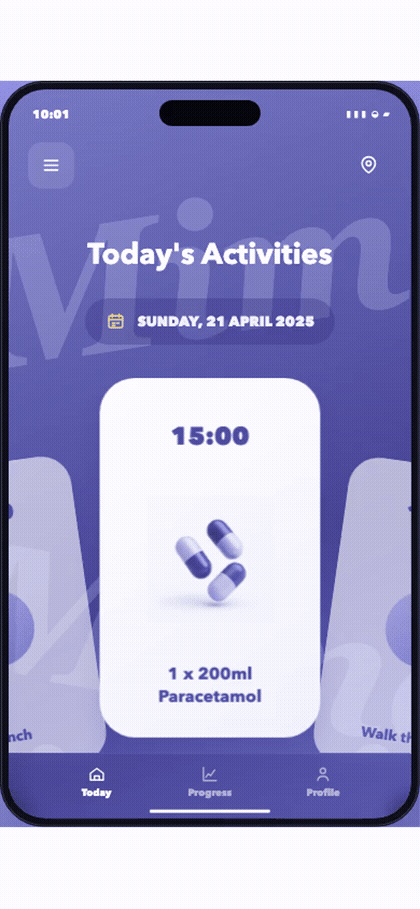
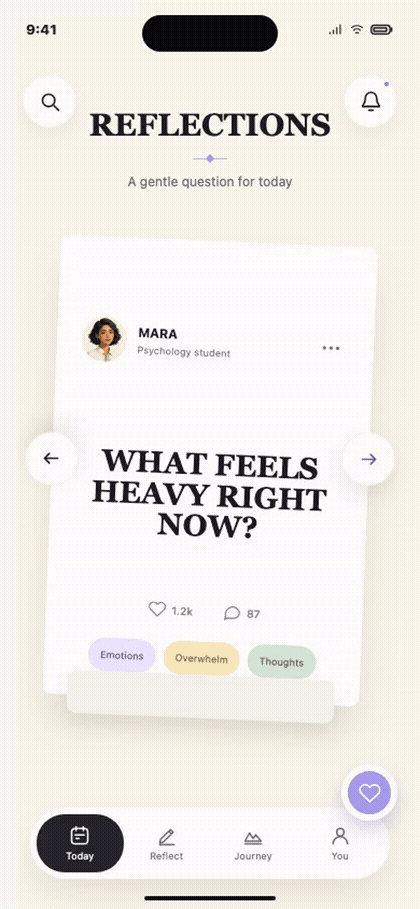
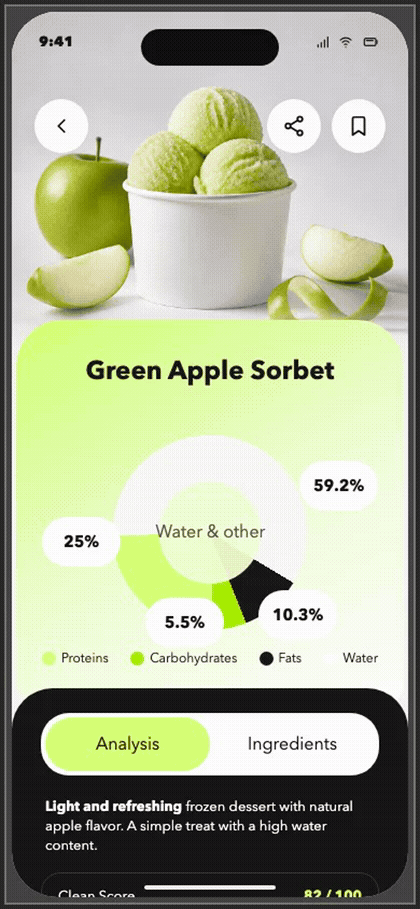
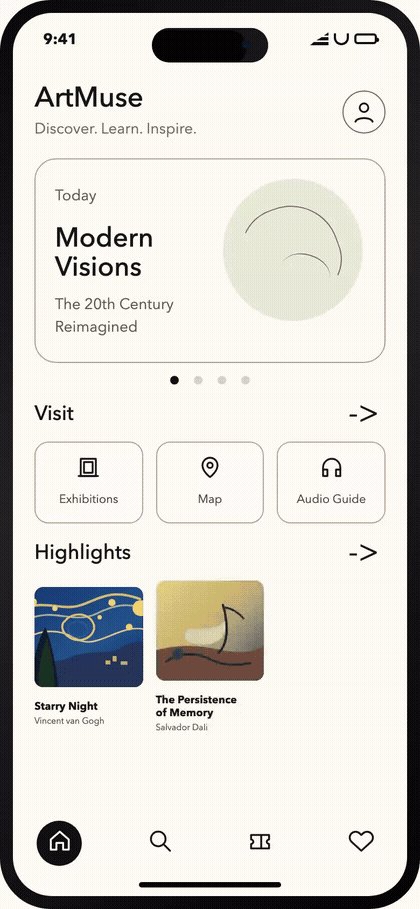
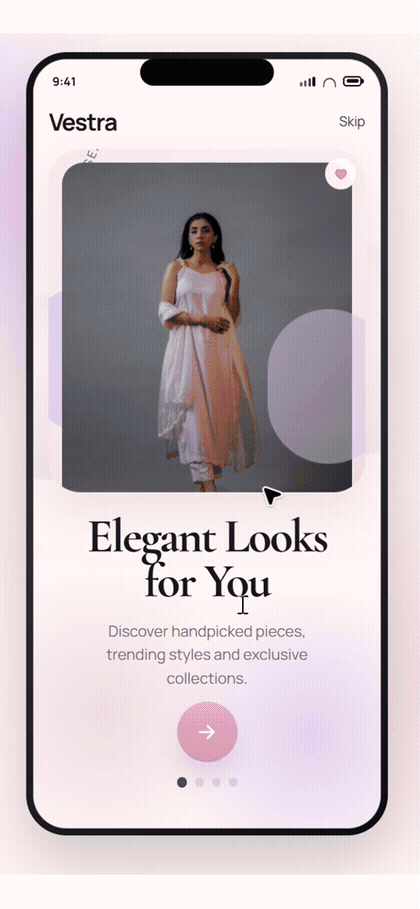

# image2_UI_skill

<p align="center">
  
</p>

<p align="center">
  <strong>把参考图、设计稿或一句描述，变成真正可运行、可点击、可继续修改的 UI。</strong>
</p>

<p align="center">
  不是把整页做成一张图：界面结构、文字、按钮、导航和交互由代码与组件实现；人物、产品、动物、照片、插画和复杂背景等视觉资产由 image2 生成并融入真实布局。
</p>

## 能实现什么

| 能力 | 最终效果 |
| --- | --- |
| **UI 忠实复刻** | 从截图、设计稿或 App 页面还原成可运行的真实界面，保留版式、比例、层级和视觉关系。 |
| **参考图重新设计** | 保留参考图的视觉语言、构图气质或品牌感觉，生成新的页面，而不是简单照抄。 |
| **从零创建 UI** | 从产品描述直接生成移动端、Web、Dashboard、Landing Page 等完整界面。 |
| **复杂视觉资产生成** | 为页面生成真实可用的人物、动物、产品、照片、插画、背景与 cutout subject，并与文字和组件自由组合。 |
| **Design System / 组件复用** | iOS、Material、Ant Design、shadcn/Radix 等体系优先复用现有组件与 icon，同类页面保持一致的设计 DNA。 |
| **强视觉图文排版** | 支持抠图、自由叠层、文字穿插、Hero、卡片、海报式构图，不被矩形图片框限制。 |
| **移动端细节** | 处理 Safe Area、Dynamic Island、Status Bar、Home Indicator、Bottom Nav 与 CTA 等真实设备细节。 |
| **可点击交付** | 输出 HTML / 前端项目，而不是只有效果图；可以继续改代码、接数据、补交互。 |

## 实际效果

### Featured image2 output

<p align="center">
  
</p>

<p align="center"><sub>Actual generated output · Golden retriever / summer pool visual</sub></p>

## Demo Videos

<table>
  <tr>
    <td width="50%"></td>
    <td width="50%"></td>
  </tr>
  <tr>
    <td width="50%"></td>
    <td width="50%"></td>
  </tr>
  <tr>
    <td colspan="2" align="center"></td>
  </tr>
</table>

## 输出不是“图片版 UI”

最终结果强调四件事：

- **真实代码 UI** — 文案、按钮、导航、表单、状态、交互都能继续编辑。
- **真实视觉资产** — 人物、产品、动物、摄影、插画和背景可以用 image2 独立生成，不把整张截图当页面。
- **组件一致性** — 同一个 Status Bar、Bottom Nav、Button、Icon 不会每个页面重新画一套。
- **视觉完成度** — 关注构图密度、裁切、Safe Area、图文关系、层级和最终浏览器 Render，而不只关注“代码能运行”。

## 适合什么场景

- App / Web 页面复刻
- Figma / Screenshot to UI
- Landing Page / Campaign Page
- Dashboard / SaaS
- 电商、内容、社交、工具型产品
- 强视觉 Hero / Editorial Layout
- Design System 对比与组件化生成
- 快速做可点击产品原型

## Quick Start

Windows PowerShell:

```powershell
git clone https://github.com/zhu-guli326/image2_UI_skill.git "$env:USERPROFILE\.codex\skills\image2_UI_skill"
```

macOS / Linux:

```bash
git clone https://github.com/zhu-guli326/image2_UI_skill.git "${CODEX_HOME:-$HOME/.codex}/skills/image2_UI_skill"
```

示例：

```bash
image2-ui run <project-dir> --mode recreate --task "Recreate this UI faithfully" --reference reference.png
```

```bash
image2-ui run <project-dir> --mode redesign --task "Redesign this reference for my product" --reference reference.png
```

```bash
image2-ui run <project-dir> --mode create --task "Create a premium mobile app"
```

## More

- **UI Case Gallery** — <https://zhu-guli326.github.io/ui_case/library.html?lang=zh>
- **Design Systems** — <https://zhu-guli326.github.io/ui_case/brands.html?lang=zh>
- **UI Vocabulary** — <https://zhu-guli326.github.io/ui_case/vocabulary.html?lang=zh>
- **Skill specification** — [SKILL.md](./SKILL.md)
- **Production / validation** — [PRODUCTION.md](./PRODUCTION.md)
- **Video case index** — [references/video-case-previews.md](./references/video-case-previews.md)

## Contact

- Email: [juguli326@gmail.com](mailto:juguli326@gmail.com)
- WeChat: `13434361868`
