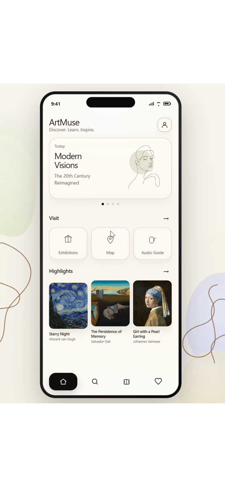
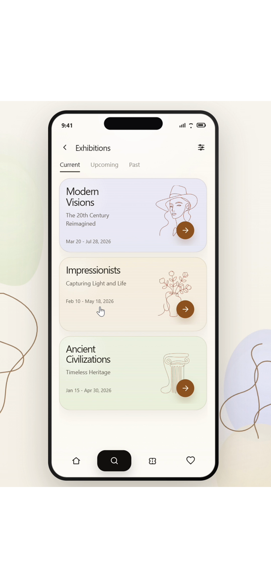
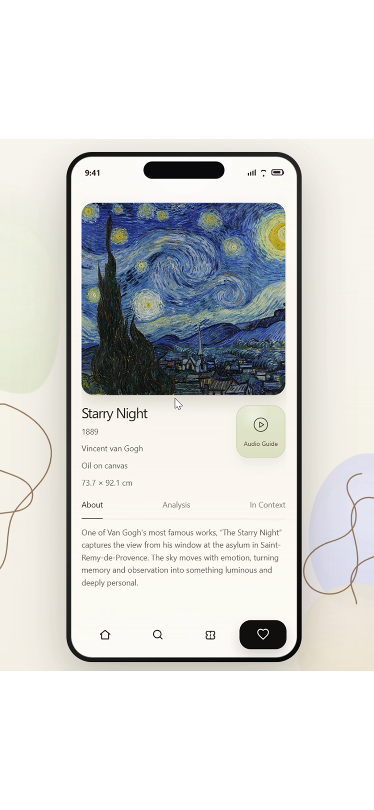
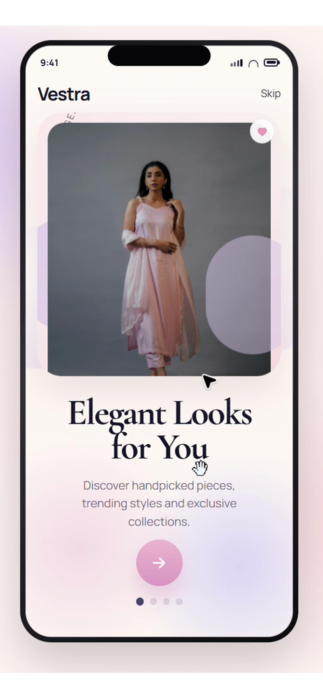
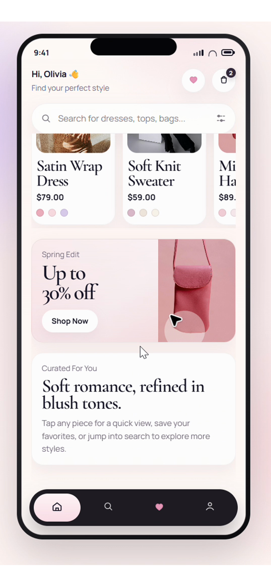
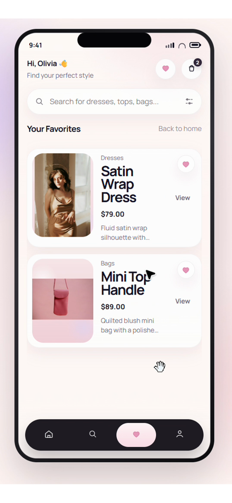
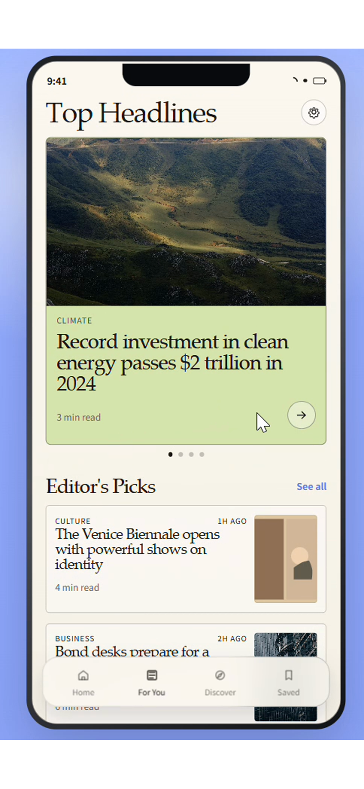
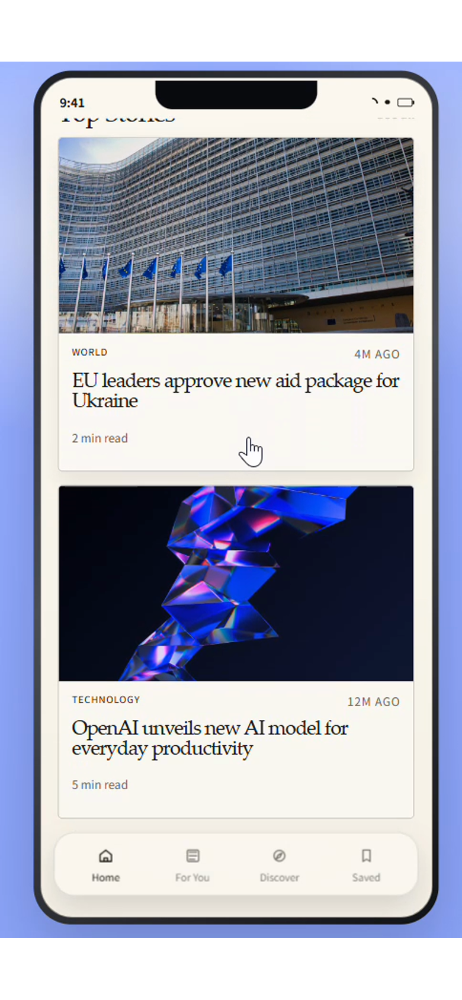
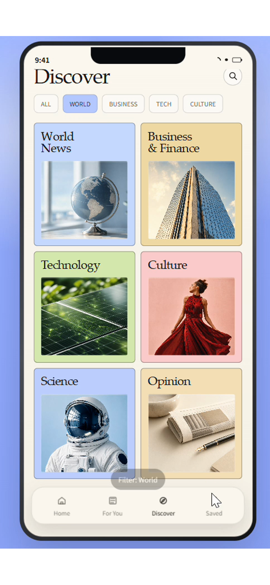

# Image2 UI Skill

把 UI 截图、设计稿、App 参考图交给 Codex，生成可点击 demo。

核心原则：

- 复杂视觉、照片、产品图、纹理、插画、抠图：调用 `image2` 生成资产。
- 文字、按钮、状态栏、导航、普通 icon、表单、交互控件：用代码实现。
- 图片资产落地到项目目录，并接回页面。

## 安装

Windows PowerShell：

```powershell
git clone https://github.com/zhu-guli326/image2_UI_skill.git "$env:USERPROFILE\.codex\skills\image2_UI_skill"
```

macOS / Linux：

```bash
git clone https://github.com/zhu-guli326/image2_UI_skill.git "${CODEX_HOME:-$HOME/.codex}/skills/image2_UI_skill"
```

安装后重开 Codex，或新开一个会话。

## 用法

```text
使用 image-to-ui-skill，参考我上传的图，做一个可点击 demo。
需要真实调用 image2 生成必要图片资产，并接回页面。
```

## 案例图片

### hicolor

<p align="center">
  <a href="./assets/cases/hicolor/traffic-3-days.png"></a>
  <a href="./assets/cases/hicolor/threads-recommendation.png"></a>
</p>

<p align="center">
  <a href="./assets/cases/hicolor/xiaohongshu-pinned.jpg"></a>
</p>

### Museum App

<p align="center">
  <a href="./assets/cases/museum-app/reference-overview.png"></a>
  <a href="./assets/cases/museum-app/museum-app-demo.mp4"></a>
</p>

<p align="center">
  <a href="./assets/cases/museum-app/home-screen.png"></a>
  <a href="./assets/cases/museum-app/exhibitions-screen.png"></a>
  <a href="./assets/cases/museum-app/detail-screen.png"></a>
</p>

<p align="center"><a href="./assets/cases/museum-app/museum-app-demo.mp4">查看 Museum App 视频</a></p>

### Fashion Shopping App

<p align="center">
  <a href="./assets/cases/fashion-shopping-app/reference-overview.png"></a>
  <a href="./assets/cases/fashion-shopping-app/fashion-app-demo.mp4"></a>
</p>

<p align="center">
  <a href="./assets/cases/fashion-shopping-app/hero-screen.png"></a>
  <a href="./assets/cases/fashion-shopping-app/catalog-screen.png"></a>
  <a href="./assets/cases/fashion-shopping-app/favorites-screen.png"></a>
</p>

<p align="center"><a href="./assets/cases/fashion-shopping-app/fashion-app-demo.mp4">查看 Fashion Shopping App 视频</a></p>

### News App

<p align="center">
  <a href="./assets/cases/news-app/reference-overview.png"></a>
  <a href="./assets/cases/news-app/news-app-demo.mp4"></a>
</p>

<p align="center">
  <a href="./assets/cases/news-app/headlines-screen.png"></a>
  <a href="./assets/cases/news-app/feed-screen.png"></a>
  <a href="./assets/cases/news-app/discover-screen.png"></a>
</p>

<p align="center"><a href="./assets/cases/news-app/news-app-demo.mp4">查看 News App 视频</a></p>
