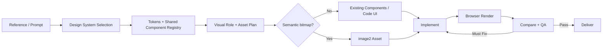

# image2_UI_skill

<p align="center">
  
</p>

<p align="center">
  <strong>Reference / Prompt → Design System → Components → image2 Assets → Real UI → Render QA</strong>
</p>

<p align="center">
  面向 UI 还原、重设计和从零创建的 production-oriented UI Agent Harness。最终交付是真实、可点击、可编辑的界面，而不是一张扁平截图。
</p>

<p align="center">
  <a href="#quick-start">Quick Start</a> ·
  <a href="#three-workflows">Workflows</a> ·
  <a href="#visual-examples">Visual Examples</a> ·
  <a href="#how-the-harness-works">Harness</a> ·
  <a href="#docs--gallery">Docs & Gallery</a>
</p>

---

## What this project is

`image2_UI_skill` 不把“截图像素”当最终 UI。它会先理解设计系统、组件、视觉资产和布局关系，再实现真实前端，并通过浏览器 Render 做验证和修复。

| Principle | What it means |
| --- | --- |
| **Real UI, not a flat bitmap** | 文案、按钮、导航、表单、状态栏和普通功能图标由代码渲染。 |
| **Design system before drawing** | 先选择/识别 Design System，抽 Tokens 和共享组件，再组合页面。 |
| **image2 only where imagery belongs** | 人物、产品、照片、插画、背景、抠图主体等语义图像进入 image2 / project asset 流程。 |
| **Render is the quality test** | Harness 检查浏览器最终效果，并执行有界的 `verify → fix → verify`。 |

## Three workflows

| Mode | Input | Source of truth | Best for |
| --- | --- | --- | --- |
| **Recreate** | Screenshot / design reference | Original reference | 忠实还原，不额外引入一次 AI 重画误差 |
| **Redesign** | Reference + new direction | Approved Effect Image | 保留设计语言，但改变产品、内容或布局 |
| **Create** | Product description | Approved Effect Image | 从零设计新 UI |

### Recreate

```text
Reference
  ↓
Design System + Component / Asset Decomposition
  ↓
Implement
  ↓
Browser Render + Compare
  ↓
Fix ↺
```

原始截图是视觉证据和对比基准，**不是最终可交付位图的来源**。

### Redesign / Create

```text
Reference or Prompt
  ↓
Generate Effect Image
  ↓
Review / Approve
  ↓
Decompose + Implement
  ↓
Browser Render + Verify
```

Effect Image 是设计规格；最终交付依然是真实代码 UI。

## Visual examples

<table>
  <tr>
    <td width="50%">
      
    </td>
    <td width="50%">
      
    </td>
  </tr>
  <tr>
    <td><strong>Design-system comparison</strong><br>同一个产品意图，拆分成不同组件体系和视觉语言。</td>
    <td><strong>Reference comparison</strong><br>参考图驱动的拆解、实现与 Render 对比。</td>
  </tr>
</table>

这些案例来自配套的 [`ui_case`](https://github.com/zhu-guli326/ui_case) 视觉案例库。Skill 仓库保持 Runtime / Contracts 足够轻，重型截图、GIF、视频和实验页面放在 Gallery 中维护。

对复杂 Recreate，Harness 会重点检查：

- iOS / Android 等平台 Chrome 是否一致、共享组件是否漂移；
- Safe Area / Home Indicator / Gesture 区域是否真正留出空间；
- 主体是否在裁切前被完整保存；
- 需要和文字穿插的主体是否真正使用 cutout，而不是矩形图片框；
- background plate、inline photo、cutout subject 是否分类正确；
- typography、density、图片比例、CTA、Bottom Nav 是否接近参考图。

目标不是偶然做对一张图，而是这些规则能稳定迁移到**下一张参考图**。

## How the Harness works


```mermaid
flowchart LR
    A["Reference / Prompt"] --> B["Design System Selection"]
    B --> C["Tokens + Shared Component Registry"]
    C --> D["Visual Role + Asset Plan"]
    D --> E{"Semantic bitmap?"}
    E -->|"No"| F["Existing Components / Code UI"]
    E -->|"Yes"| G["image2 Asset"]
    F --> H["Implement"]
    G --> H
    H --> I["Browser Render"]
    I --> J["Compare + QA"]
    J -->|"Must Fix"| H
    J -->|"Pass"| K["Deliver"]
```

### 1. Reuse before custom draw

组件默认解析顺序：

```text
Design-system component
→ Platform component
→ Project shared component
→ Compatible library
→ Custom draw only after lookup misses
```

对于 iOS-like 页面，默认优先使用共享的 Safe Area、Status Bar、Dynamic Island / display cutout、Home Indicator、Navigation、Button，以及 SF Symbols 语义的功能图标。

同一个 Status Bar / Bottom Nav / CTA / Chip / Card 不应该在三张 Screen 里分别重新画三遍；差异应该落到 variant / token。

### 2. Visual roles before image generation

实现前先把可见内容分成：

```text
code-ui
 graphic-primitive
 background-plate
 cutout-subject
 inline-photo
 generated-clean
```

需要和标题、正文发生穿插或跨边界关系的人物 / 动物 / 产品，应当作为 **cutout layout primitive**，而不是被锁在矩形 media box 里。

### 3. Runtime owns the loop

```text
Runtime
├── State Machine
├── Runner / Resume / Event Log
├── Verify → Fix → Verify
└── Optional Multi-Agent DAG Scheduler
```

Multi-Agent 只是同一个 Runtime 内部的执行策略，不是第二套 Workflow，也不是第二套 Run State。

## Quick Start

### Install

**Windows PowerShell**

```powershell
git clone https://github.com/zhu-guli326/image2_UI_skill.git "$env:USERPROFILE\.codex\skills\image2_UI_skill"
```

**macOS / Linux**

```bash
git clone https://github.com/zhu-guli326/image2_UI_skill.git "${CODEX_HOME:-$HOME/.codex}/skills/image2_UI_skill"
```

安装后重启 Codex，或开启一个新会话。

### Recreate a reference

```bash
image2-ui run <project-dir> \
  --mode recreate \
  --task "Recreate this UI faithfully" \
  --reference reference.png
```

### Redesign a reference

```bash
image2-ui run <project-dir> \
  --mode redesign \
  --task "Redesign this reference for my product" \
  --reference reference.png
```

### Create from a prompt

```bash
image2-ui run <project-dir> \
  --mode create \
  --task "Create a premium mobile finance dashboard"
```

默认路由：**带 `--reference` → Recreate；没有 `--reference` → Create。** Redesign 需要显式选择。

Redesign / Create 需要人工确认 Effect Image 时加：

```bash
--require-effect-review
```

确认后继续：

```bash
image2-ui resume <project-dir> --latest --decision approved
```

## Optional Multi-Agent execution

复杂任务可以让 Runtime 启用视觉分析、资产工程、架构、代码审查、Accessibility 和 QA 等角色：

```bash
image2-ui run <project-dir> \
  --mode recreate \
  --task "Recreate this production UI" \
  --reference reference.png \
  --execution multi-agent \
  --max-parallel 2
```

Canonical run state 始终位于：

```text
<project>/.image2-ui/runs/<run-id>/
├── state.json
├── events.jsonl
└── scheduler/
```

## Common commands

```bash
image2-ui doctor
image2-ui validate <demo-dir> --reference <reference-image>
image2-ui compare --reference <reference-image> --actual <output-image>
image2-ui loop <demo-dir> --reference <reference-image>
image2-ui inspect <project-dir> --latest --json
image2-ui resume <project-dir> --latest
```

开发检查：

```bash
npm test
npm run doctor
npm run pack:check
```

## Docs & Gallery

### Project docs

- [SKILL.md](./SKILL.md) — Agent-facing operating instructions
- [PRODUCTION.md](./PRODUCTION.md) — production / release requirements
- [references/](./references/) — Design System、Asset、Overlay、Safe Area、Verification contracts
- [schemas/](./schemas/) — machine-readable Harness contracts
- [tests/](./tests/) — regression coverage

### UI case gallery

- [Explore / launcher](https://zhu-guli326.github.io/ui_case/launcher.html?intent=explore)
- [UI case library](https://zhu-guli326.github.io/ui_case/library.html?lang=zh)
- [UI vocabulary](https://zhu-guli326.github.io/ui_case/vocabulary.html?lang=zh)
- [Design systems](https://zhu-guli326.github.io/ui_case/brands.html?lang=zh)
- [Design skills](https://zhu-guli326.github.io/ui_case/skills.html?lang=zh)
- [ui_case repository](https://github.com/zhu-guli326/ui_case)

### Included video demos

| Demo | Focus |
| --- | --- |
| [Mimo Activities](./assets/video-cases/mimo-activities-demo.mp4) | 活动流、卡片层级、移动端浏览节奏 |
| [Softly Reflections](./assets/video-cases/softly-reflections-demo.mp4) | 日记、柔和过渡、空状态 |
| [Cleanbite Scanner](./assets/video-cases/cleanbite-scanner-demo.mp4) | 扫码识别、结果状态、操作反馈 |
| [Museum App](./assets/video-cases/museum-app-demo.mp4) | 多屏导航、缩略图、详情页串联 |
| [Fashion Shopping App](./assets/video-cases/fashion-shopping-app-demo.mp4) | 商品视觉资产、筛选、详情展示 |

## Repository map

```text
image2_UI_skill
├── SKILL.md
├── runtime/
│   └── scheduler/
├── schemas/
├── references/
├── scripts/
├── tests/
└── assets/
    ├── readme/
    └── video-cases/
```

## Contact

- Email: [juguli326@gmail.com](mailto:juguli326@gmail.com)
- WeChat: `13434361868`
