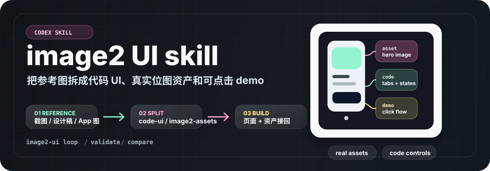

# Image2 UI — Screenshot to Code & AI UI Generation for OpenAI Codex

<p align="center">
  <strong>Turn screenshots, design references, Figma exports, or text prompts into editable, interactive frontend UI.</strong>
</p>

<p align="center">
  面向 Codex 的开源 Image-to-UI Skill 与 CLI：把截图、设计稿、参考图或一句产品描述，变成真正可运行、可点击、可继续修改的前端界面。
</p>

<p align="center">
  <a href="./LICENSE"></a>
  
  
  
</p>

<p align="center">
  
</p>

**Image2 UI** is an open-source **OpenAI Codex skill and CLI toolkit** for **screenshot-to-code**, **image-to-UI**, **design-to-code**, and **AI frontend generation**. Common workflows include UI-to-code, image-to-code, screenshot-to-HTML, and Figma-to-code. It separates editable interface structure from complex bitmap artwork: text, buttons, navigation, forms, layout, and interactions stay in code, while photos, people, products, illustrations, cutouts, and backgrounds can be generated as reusable image assets.

它不是把整张设计稿塞进网页当背景图，而是用真实前端代码实现 UI，用独立图像资产完成高视觉表现，并通过渲染、对比和验证循环提高还原度。

## Why Image2 UI

- **Real code, not a flattened mockup** — 文案、按钮、导航、表单、状态和交互都可编辑、可继续开发。
- **Three explicit workflows** — 支持忠实还原、参考重设计，以及从产品描述创建全新 UI。
- **Visual asset generation** — 人物、商品、动物、摄影、插画、纹理、背景和透明抠图可作为独立资产融入布局。
- **Screenshot fidelity loop** — 支持浏览器渲染、参考图对比、视觉审计和有界修复循环。
- **Design-system aware** — 可优先复用 iOS、Material Design、Ant Design、shadcn/ui、Radix 等现有组件与图标体系。
- **Production-oriented runtime** — 运行状态可持久化，可检查、恢复，并支持单 Agent 或多 Agent 执行。
- **Mobile UI details** — 覆盖 Safe Area、Dynamic Island、Status Bar、Home Indicator、Bottom Navigation 和 CTA 等设备细节。

## Demos

These are rendered, clickable UI demos—not static concept images. The animated previews show navigation, state changes, generated bitmap assets, and code-rendered controls working together.

<div align="center">
  <table>
    <tr>
      <td align="center" width="50%">
        <strong>Fashion Shopping App</strong><br>
        <sub>Product imagery, onboarding, filters, catalog, and product details</sub><br>
        
      </td>
      <td align="center" width="50%">
        <strong>Cleanbite Scanner</strong><br>
        <sub>Generated food imagery, scanning flow, result states, and feedback</sub><br>
        
      </td>
    </tr>
    <tr>
      <td align="center" width="50%">
        <strong>Softly Reflections</strong><br>
        <sub>Journal interactions, card transitions, and personalized states</sub><br>
        
      </td>
      <td align="center" width="50%">
        <strong>Mimo Activities</strong><br>
        <sub>Activity feed, mobile cards, progress states, and browsing rhythm</sub><br>
        
      </td>
    </tr>
  </table>
</div>

<p align="center">
  <strong><a href="https://zhu-guli326.github.io/ui_case/library.html?lang=zh">Explore the complete UI Case Gallery →</a></strong>
</p>

## Three Workflow Modes

| Mode | Input | Source of truth | Best for |
| --- | --- | --- | --- |
| `recreate` | Screenshot, mockup, or design reference | Original reference | Screenshot-to-code, UI replication, faithful frontend recreation |
| `redesign` | Visual reference + new product requirements | Reviewed Effect Image | Applying a visual language to a new layout, brand, or experience |
| `create` | Text description | Reviewed Effect Image | AI UI generation, product prototypes, landing pages, dashboards, and mobile apps |

```text
recreate: reference  → analyze → implement → render and compare → fix
redesign: reference  → visual direction → effect image → implement → verify
create:   description → visual direction → effect image → implement → verify
```

With `--reference` and no explicit mode, the runtime defaults to `recreate`. Without `--reference`, it defaults to `create`. Select `redesign` explicitly when the reference should inspire a new interface instead of being copied faithfully.

## Quick Start

### Requirements

- Node.js 20 or newer
- Python 3.10 or newer
- Codex
- Optional: Playwright/Chromium for browser render checks
- Optional: an `image2` command or a configured image-generation API key for bitmap asset generation

### Install the Codex skill and CLI

Windows PowerShell:

```powershell
$skillDir = Join-Path $env:USERPROFILE ".codex\skills\image2_UI_skill"
git clone https://github.com/zhu-guli326/image2_UI_skill.git $skillDir
Set-Location $skillDir
npm link
image2-ui doctor
```

macOS / Linux:

```bash
skill_dir="${CODEX_HOME:-$HOME/.codex}/skills/image2_UI_skill"
git clone https://github.com/zhu-guli326/image2_UI_skill.git "$skill_dir"
cd "$skill_dir"
npm link
image2-ui doctor
```

`npm link` exposes the bundled `image2-ui` command globally from the checkout. To work on the repository without installing the global command, use `node scripts/image2-ui --help`.

## Usage

### 1. Recreate a UI from a screenshot

```bash
image2-ui run ./output \
  --mode recreate \
  --task "Recreate this mobile UI faithfully" \
  --reference ./reference.png
```

### 2. Redesign a visual reference

```bash
image2-ui run ./output \
  --mode redesign \
  --task "Keep the visual language, but redesign it for a travel app" \
  --reference ./reference.png
```

### 3. Generate a new UI from a description

```bash
image2-ui run ./output \
  --mode create \
  --task "Create a premium mobile finance dashboard"
```

### Inspect or resume a run

```bash
image2-ui inspect ./output --latest --json
image2-ui resume ./output --latest
```

### Validate and compare rendered output

```bash
image2-ui validate ./output --reference ./reference.png
image2-ui compare --reference ./reference.png --actual ./output.png
image2-ui loop ./output --reference ./reference.png
```

## Use Cases: Screenshot to Code, Figma to Code, and AI UI Generation

- Screenshot to frontend code / screenshot to HTML workflows
- Figma exports and design references to editable UI
- Mobile apps for iOS and Android-style layouts
- Web apps, SaaS dashboards, admin panels, and internal tools
- Landing pages, campaign pages, and editorial layouts
- Ecommerce catalogs, product pages, social feeds, and content apps
- Clickable product prototypes with generated visual assets
- Design-system-aware interface variations

## How It Differs from a Screenshot Generator

| Interface element | Implemented as |
| --- | --- |
| Text, buttons, forms, navigation, status, layout, interaction | Editable code and reusable components |
| Photos, people, products, animals, illustrations, textures, backgrounds | Separate bitmap assets generated or prepared for the project |
| Complete screenshot or Effect Image | Visual reference for implementation and verification, never the shipped interactive UI |

This separation keeps the result searchable, accessible, responsive, interactive, and maintainable. Generated image assets must not contain UI text, buttons, logos, watermarks, status bars, or small interface icons.

## CLI Commands

| Command | Purpose |
| --- | --- |
| `image2-ui run` | Start a durable `recreate`, `redesign`, or `create` workflow |
| `image2-ui inspect` | Inspect saved runtime state and event history |
| `image2-ui resume` | Resume an interrupted or review-gated run |
| `image2-ui validate` | Audit broken assets, overflow, contrast, rendering, and common visual problems |
| `image2-ui compare` | Build a side-by-side reference/output comparison board |
| `image2-ui loop` | Build, capture, validate, compare, and produce a bounded fix queue |
| `image2-ui doctor` | Check runtime versions, browser capture, media tools, fonts, output access, and image channels |

Run `image2-ui --help` for the complete command reference.

## Documentation

- [Skill specification](./SKILL.md) — Codex routing, workflow, asset, implementation, and verification rules
- [Production guide](./PRODUCTION.md) — installation, runtime lifecycle, quality gates, and release checks
- [Contributing](./CONTRIBUTING.md) — local checks and pull request guidance
- [Changelog](./CHANGELOG.md) — notable changes
- [Video case index](./references/video-case-previews.md) — case previews and source videos
- [UI Case Gallery](https://zhu-guli326.github.io/ui_case/library.html?lang=zh) — complete examples
- [Design Systems](https://zhu-guli326.github.io/ui_case/brands.html?lang=zh) — brand and component-system references
- [UI Vocabulary](https://zhu-guli326.github.io/ui_case/vocabulary.html?lang=zh) — bilingual UI section vocabulary

## Development

```bash
npm test
npm run doctor
npm run pack:check
```

See [CONTRIBUTING.md](./CONTRIBUTING.md) before opening a pull request.

## License

[MIT](./LICENSE)

## Contact

- Email: [juguli326@gmail.com](mailto:juguli326@gmail.com)
- WeChat: `13434361868`
