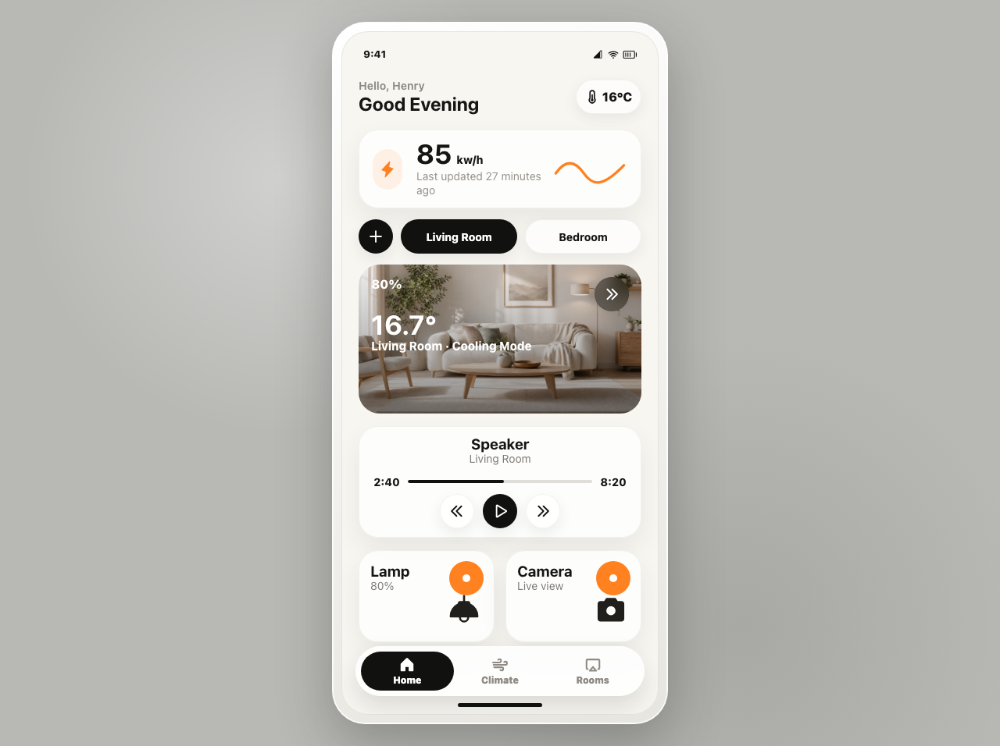
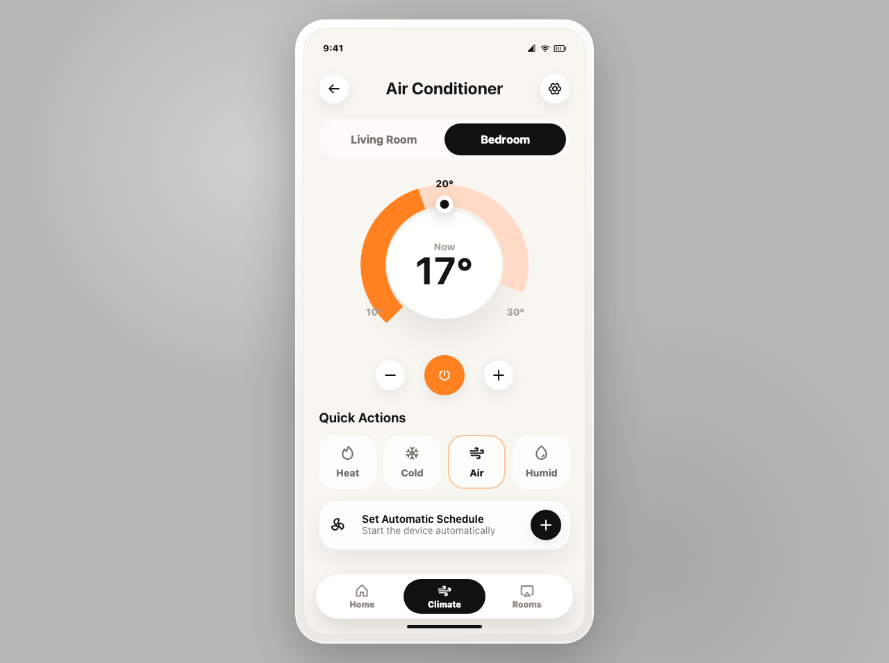
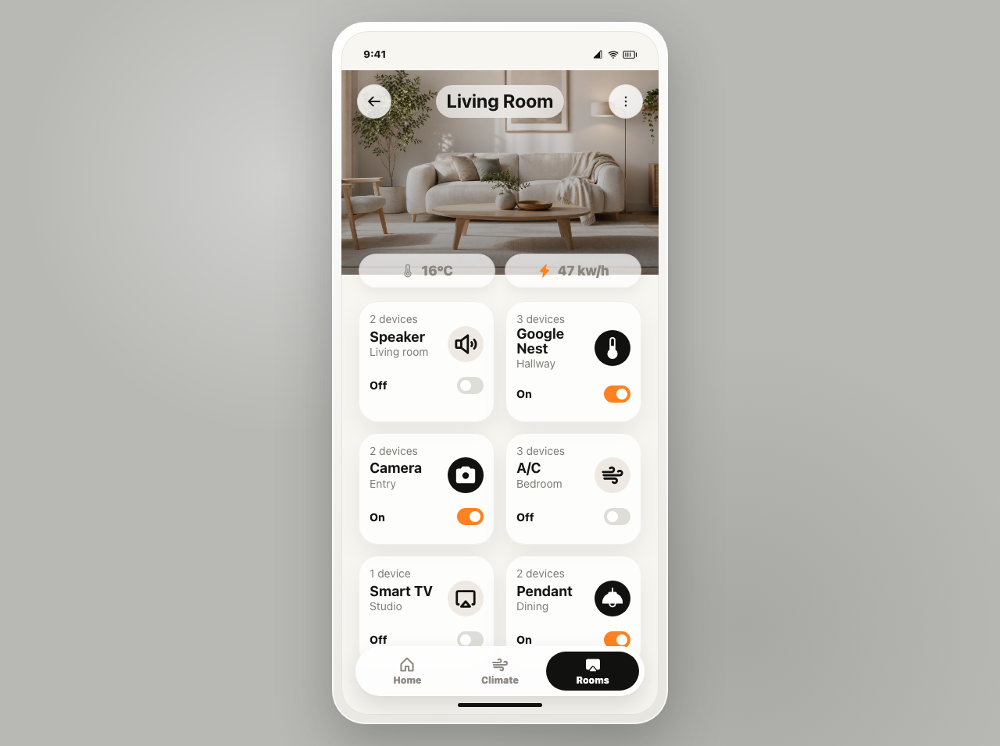

# Image2 to UI Skill

把 UI 截图、设计稿、App 参考图交给 Codex，生成可点击的网页或 App demo，并在需要真实视觉资产的位置调用 `image2` / `gpt-image-2` 生成位图。

Turn UI screenshots and design references into clickable Codex demos with code-rendered UI and real `image2` visual assets.

一句话：**一张 UI 参考图 -> 可点击 demo + 真正落地的生图资产。**

这个 skill 适合：

- 将 UI 参考图复刻成可预览、可点击的前端 demo
- 区分哪些内容应该用代码实现，哪些内容应该生成图片资产
- 为首屏主视觉、卡片缩略图、复杂插画、纹理、产品图、抠图等资产生成并接回页面
- 做手机 App 参考图时，交付带 iOS 外边框的可交互预览

[教程演示视频](https://v.douyin.com/MJLektzxKpM/)

## 为什么不一样

- 不是把整张 UI 烘焙成一张图片，而是保留真实可交互的文字、按钮和布局。
- 不是只用 CSS/SVG 临摹复杂视觉，而是把主视觉、插画、纹理、产品图等区域交给 `image2`。
- 不是让 `image2` 生成状态栏、返回箭头、底部导航或播放器小图标；这些细碎 UI glyph 必须由代码层图标库/SVG/CSS 渲染，避免错位、伪文字和乱码。设备卡片里较大的台灯、摄像头等设备外观、产品抠图、物体缩略图不是 icon，应作为 `device-product-image` / `product-cutout` / `object-cutout` 图片资产处理。
- 不是临时拼一堆图标；会先做 icon inventory，复用项目已有图标库或从 `@phosphor-icons/react`、`hugeicons-react`、`@radix-ui/react-icons`、`@tabler/icons-react` 中统一选一套，并用 coverage 表约束尺寸、线宽、状态和 aria-label。
- 最终目标不是一张截图，而是可打开、可点击、可继续改的 demo。
- 交付前加入页面输出巡检，检查破图、文字溢出、低对比度、设备卡片微型伪字、模板化渐变文字、单一 AI 配色、嵌套卡片、icon tile 模板、图标可访问性、触摸目标、图标视觉错位、位图小图标误用和交互死区等问题。
- 可生成“参考图 vs 当前输出”的对照板，把比例、间距、手机位置、图标/开关/产品图差距放到同一张 PNG/HTML 里看，避免只凭记忆复刻。
- 可运行 `image2-ui loop` 做工程闭环：构建、浏览器截图、自动巡检、参考图对比和修复队列一次完成，让每轮优化都有稳定证据。
- 融入 Impeccable 风格的设计规范：产品 UI 保持可信和一致，品牌页要有明确视觉立场；限制模板化图标卡片、重复卡片网格、粗侧边条、禁用缩放和低质量排版。
- 如果检索不到 `image2`，先用 `image2-ui doctor` 区分 native-image2 来源（系统 imagegen 或项目 image2 命令）和 Youtoken/OpenRouter ICU `gpt-image-2` 备案通道，再按实际通道落地资产。

## Demo

<table>
  <tr>
    <th>参考图</th>
    <th>复刻预览</th>
  </tr>
  <tr>
    <td></td>
    <td><a href="./assets/demo.mp4"></a></td>
  </tr>
  <tr>
    <td>原始参考图</td>
    <td><a href="./assets/demo.mp4">点击查看原视频</a></td>
  </tr>
</table>

## 案例素材

### 智能家居 App v2

新版 App 复刻 demo：客厅照片用 image2/system imagegen 生成，状态栏、返回、菜单、播放器、底部 tab、quick action、开关和设备小图标全部通过 `@phosphor-icons/react` 的统一 `UiIcon` 注册表渲染。设备卡片中的台灯、摄像头是 `device-product-image` 图片资产，不是 UI glyph；设备 tile 只保留设备名、数量/状态和开关，房间位置进入辅助语义，避免小字变成乱码。

<table>
  <tr>
    <th>首页</th>
    <th>空调控制</th>
    <th>房间设备</th>
  </tr>
  <tr>
    <td><a href="./demo/smart-home-ui-v2/screenshots/home.png"></a></td>
    <td><a href="./demo/smart-home-ui-v2/screenshots/climate.png"></a></td>
    <td><a href="./demo/smart-home-ui-v2/screenshots/room.png"></a></td>
  </tr>
  <tr>
    <td colspan="3"><a href="./demo/smart-home-ui-v2">查看 demo 源码</a></td>
  </tr>
</table>

### hicolor 增长案例

从 INS 视觉趋势出发，用 Codex 做成图片创作小工具并上线；上线 3 天获得 1,155 visitors / 2,102 page views。

<table>
  <tr>
    <th>三天访问数据</th>
    <th>传播证据</th>
  </tr>
  <tr>
    <td><a href="./assets/cases/hicolor/traffic-3-days.png"></a></td>
    <td><a href="./assets/cases/hicolor/threads-recommendation.png"></a></td>
  </tr>
  <tr>
    <td><a href="./references/hicolor-case-study.md">阅读完整 case study</a></td>
    <td><a href="./assets/cases/hicolor/xiaohongshu-pinned.jpg">查看小红书验证图</a></td>
  </tr>
</table>

### 博物馆 App

<table>
  <tr>
    <th>参考图</th>
    <th>复刻预览</th>
  </tr>
  <tr>
    <td><a href="./assets/cases/museum-app/reference-overview.png"></a></td>
    <td><a href="./assets/cases/museum-app/museum-app-demo.mp4"></a></td>
  </tr>
  <tr>
    <td><a href="./assets/cases/museum-app/reference-overview.png">原始参考图</a></td>
    <td><a href="./assets/cases/museum-app/museum-app-demo.mp4">点击查看原视频</a></td>
  </tr>
</table>

### 女装购物 App

<table>
  <tr>
    <th>参考图</th>
    <th>复刻预览</th>
  </tr>
  <tr>
    <td><a href="./assets/cases/fashion-shopping-app/reference-overview.png"></a></td>
    <td><a href="./assets/cases/fashion-shopping-app/fashion-app-demo.mp4"></a></td>
  </tr>
  <tr>
    <td><a href="./assets/cases/fashion-shopping-app/reference-overview.png">原始参考图</a></td>
    <td><a href="./assets/cases/fashion-shopping-app/fashion-app-demo.mp4">点击查看原视频</a></td>
  </tr>
</table>

### 新闻阅读 App

<table>
  <tr>
    <th>参考图</th>
    <th>复刻预览</th>
  </tr>
  <tr>
    <td><a href="./assets/cases/news-app/reference-overview.png"></a></td>
    <td><a href="./assets/cases/news-app/news-app-demo.mp4"></a></td>
  </tr>
  <tr>
    <td><a href="./assets/cases/news-app/reference-overview.png">原始参考图</a></td>
    <td><a href="./assets/cases/news-app/news-app-demo.mp4">点击查看原视频</a></td>
  </tr>
</table>

## 安装

Windows PowerShell：

```powershell
git clone https://github.com/zhu-guli326/image2_UI_skill.git "$env:USERPROFILE\.codex\skills\image2_UI_skill"
```

macOS / Linux：

```bash
git clone https://github.com/zhu-guli326/image2_UI_skill.git "${CODEX_HOME:-$HOME/.codex}/skills/image2_UI_skill"
```

安装后重开 Codex，或新开一个会话。

## 使用方式

上传 UI 参考图后，在 Codex 里直接说：

```text
使用 image-to-ui-skill，参考我上传的图，完成一个可点击预览的 demo。
需要真实调用 image2 生成必要的位图资产，并把生成结果接回页面。
技术栈用 HTML/CSS/JS。直接开始，不用先问我。
```

内部执行规则、资产规划细节和 image2 通道处理逻辑都在 `SKILL.md` 与 `references/` 中，Codex 触发 skill 后会自动读取。

诊断 image2 / fallback 通道：

```bash
image2-ui doctor
```

`doctor` 会报告：

- `system_imagegen`：本机是否安装 `.system/imagegen` skill/CLI；内置 `image_gen` 是否暴露要看当前 Codex 工具面。本 skill 把它当作 `native-image2 / source=system-imagegen`。
- `native_image2`：是否能找到项目 `image2` 命令或 `IMAGE2_COMMAND`，对应 `native-image2 / source=project-image2`。
- `fallback`：是否能找到 Youtoken/OpenRouter ICU 兼容 CLI，以及是否具备可用密钥来源。

## 输出验收

生成 demo 后，推荐先跑一轮 loop 工程闭环：

```bash
image2-ui loop ./demo/my-output --reference ./reference.png --build "npm run build"
```

`loop` 会自动执行 build、浏览器截图、`validate`、`compare`，并把结果写到 `./demo/my-output/.image2-ui/`：

- `loop-actual.png`：当前渲染截图
- `loop-reference-compare.png` / `.html`：参考图与当前输出对照
- `loop-report.md` / `.json`：Must Fix、Should Fix 和人工参考图核对清单

如果要给截图加特定捕获状态，例如智能家居三屏 demo 的宽屏复刻模式：

```bash
image2-ui loop ./demo/smart-home-ui-v2 \
  --reference /Users/zzhu/Downloads/2.jpeg \
  --build "npm run build" \
  --capture-class capture-wide
```

只做巡检时，可以运行内置验证脚本：

```bash
image2-ui validate ./demo/my-output --reference ./reference.png
```

它会调用 skill 内置的 `scripts/ui_output_audit.mjs`，先做静态资产检查；如果环境有 Playwright，会继续做浏览器渲染检查，用于发现破图、横向滚动、文字溢出、低对比度、设备卡片微型伪字、嵌套卡片、图标可访问性、触摸目标过小和常见 AI 味视觉问题。

如果已经有渲染截图，可以生成参考图/输出图对照板：

```bash
image2-ui compare --reference ./reference.png --actual ./screenshots/output.png --out ./screenshots/reference-output-compare.png
```

`compare` 会输出左右对照和半透明 overlay，重点检查手机比例、垂直位置、卡片间距、状态栏、返回/菜单、播放器、quick action、开关、设备产品图和小字密度。PNG 输出会自动调用本机 Chrome；如果没有 Chrome，则保留 HTML 对照板。

`dense-micro-text` 会提示设备卡片、tile、播放器或 quick action 内小到像伪字的可见文本。修法通常不是继续缩小字号，而是删掉非必要元信息、放到 `aria-label`/title/详情页，或扩大卡片后让设备名、数量/状态和开关各自有稳定区域。

对 App / 智能家居 / 设备控制类参考图，`validate` 还会提示疑似把状态栏、导航、菜单、按钮、播放器或普通 UI icon 做成 raster image 的情况。正确做法是按角色判断：客厅照片、设备产品图、产品/物体抠图、背景质感交给 `image2`；状态栏、按钮、底部 tab、开关、小型语义 glyph 和文字全部用代码渲染。`device-camera.png` 这类产品图不应误报为 icon，但 `tab-camera-icon.png` 这类控件小图仍应改成代码图标。

React/Next demo 的图标系统默认只能选一套：`@phosphor-icons/react`、`hugeicons-react`、`@radix-ui/react-icons` 或 `@tabler/icons-react`；纯 HTML demo 用统一 SVG sprite/helper。`validate` 会提示多套 approved icon 包、未批准 icon 包、混合 icon 技术和按钮/导航里误用位图 icon 的情况。

`off-center-icon` 会提示真实浏览器截图里 icon-only button、状态栏、播放器、quick action 或开关内的 SVG 视觉中心偏离容器中心。修法通常是统一 `.ui-icon` 的 display/line-height、把 hit area 与 glyph 尺寸分开，并对播放三角、箭头、Wi-Fi、电池等做 0.3-1px 的光学偏移。

如果 `image2-ui` 还没加入 PATH，可以在 skill 目录运行：

```bash
node scripts/image2-ui loop ./demo/my-output --reference ./reference.png --build "npm run build"
node scripts/image2-ui validate ./demo/my-output --reference ./reference.png
node scripts/image2-ui compare --reference ./reference.png --actual ./screenshots/output.png --out ./screenshots/reference-output-compare.png
```

Keywords: Codex skill, image2, image2 生图, system imagegen, image_gen, gpt-image-2, Youtoken image, OpenRouter ICU, image-to-ui, UI screenshot to code, design to code, clickable prototype, app demo, frontend demo, AI assets.
